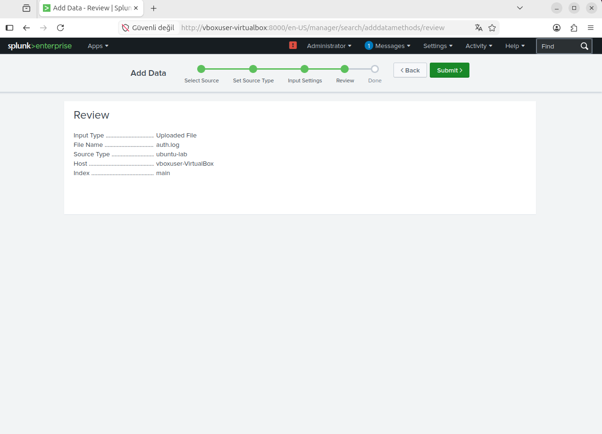
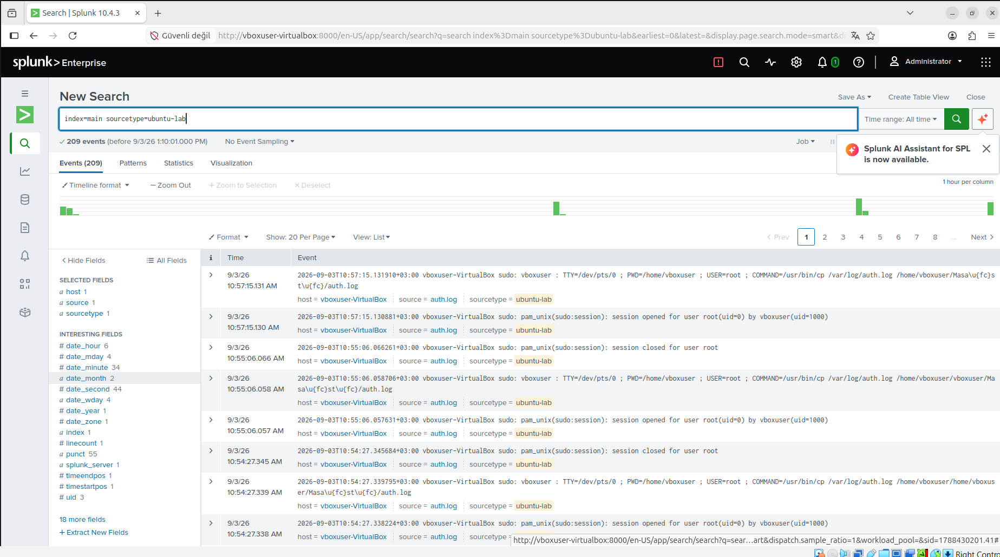
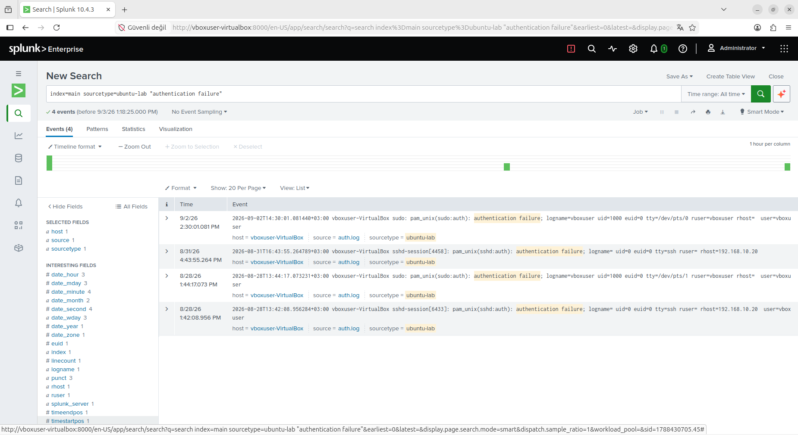
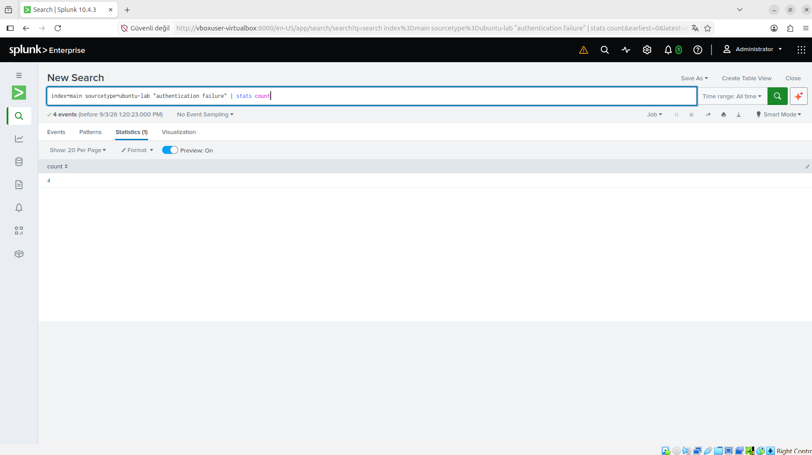
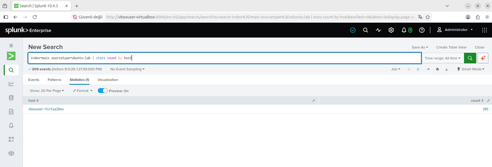
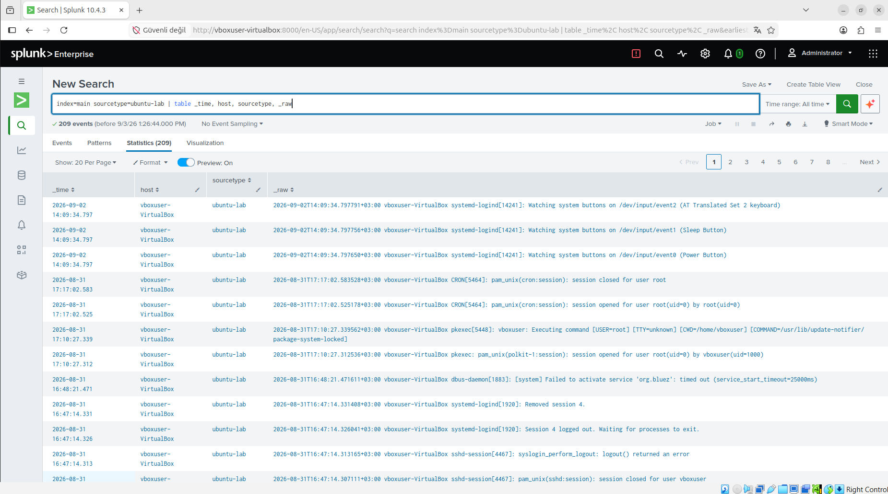
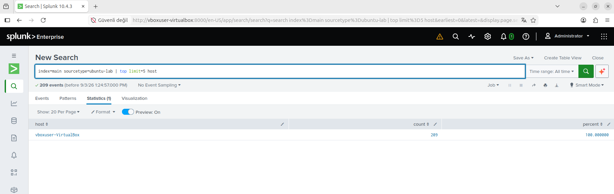
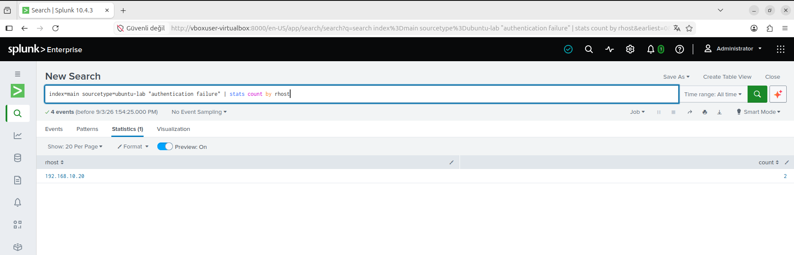

# Gün 19: Veri Besleme ve Temel SPL

## 1. Sabah: Veri Besleme (Data Ingestion)

Ubuntu işletim sistemine ait kimlik doğrulama ve erişim loglarını barındıran `/var/log/auth.log` dosyası, Splunk Enterprise ortamına aktarıldı.

### Veri Girişi Yapılandırması (Review)
Dosya yükleme aşamasında Splunk arayüzünden (`Settings > Add Data > Upload`) aşağıdaki meta veri tanımlamaları yapıldı:

* **Input Type:** Uploaded File
* **File Name:** `auth.log`
* **Source Type:** `ubuntu-lab`
* **Host:** `vboxuser-VirtualBox`
* **Index:** `main`



---

## 2. Doğrulama ve İlk SPL Arama Sonucu

Yükleme tamamlandıktan sonra `Search & Reporting` uygulamasında verilerin başarıyla indekslendiği doğrulandı.

* **Çalıştırılan Sorgu:**
  ```spl
  index=main sourcetype=ubuntu-lab



---

## 3. SPL Pratik: Temel Sorgu Yapıları

Bugün öğrenilen temel SPL yapıları (arama terimi, `stats count`, `stats count by`, `table`, `top`) kendi `auth.log` verim üzerinde denendi. Aşağıda her yapı için çalıştırılan sorgu, sonucu ve kanıt olarak alınan ekran görüntüsü yer almaktadır.

### 3.1 Arama Terimi (Search Term) — `grep` karşılığı

Belirli bir kelimeyi (`authentication failure`) doğrudan aratarak ilgili olayları filtreledim.

* **Çalıştırılan Sorgu:**
  ```spl
  index=main sourcetype=ubuntu-lab "authentication failure"
  ```
* **Sonuç:** 4 olay bulundu (tüm zaman aralığında). Olaylar arasında hem `sudo` hem de `sshd-session` kaynaklı kimlik doğrulama hataları mevcut; bazılarında `rhost=192.168.10.20` alanı görülüyor.



### 3.2 `stats count` — `wc -l` karşılığı

Bir önceki aramanın sonuçlarını tek bir toplam sayıya indirgemek için `stats count` kullandım.

* **Çalıştırılan Sorgu:**
  ```spl
  index=main sourcetype=ubuntu-lab "authentication failure" | stats count
  ```
* **Sonuç:** `count = 4`



### 3.3 `stats count by` — `sort | uniq -c` karşılığı

Olayları bir alana (bu denemede `host`) göre gruplayıp saydım.

* **Çalıştırılan Sorgu:**
  ```spl
  index=main sourcetype=ubuntu-lab | stats count by host
  ```
* **Sonuç:** `host=vboxuser-VirtualBox`, `count=209` (toplam veri setindeki tüm olaylar tek host üzerinden geldiği için tek satır döndü).



### 3.4 `table` — Seçili Alanları Tablo Halinde Gösterme

Ham olayları (`_raw`) ve ilgili alanları (`_time`, `host`, `sourcetype`) düzenli bir tabloda görüntüledim.

* **Çalıştırılan Sorgu:**
  ```spl
  index=main sourcetype=ubuntu-lab | table _time, host, sourcetype, _raw
  ```
* **Sonuç:** 209 satırlık tablo (8 sayfa, sayfa başına 20 kayıt). `systemd-logind`, `CRON`, `pkexec`, `dbus-daemon`, `sshd-session` gibi farklı kaynaklardan gelen olaylar görüldü.



### 3.5 `top` — En Sık Görülen Değerler

`host` alanındaki en sık görülen değerleri `top` komutuyla listeledim.

* **Çalıştırılan Sorgu:**
  ```spl
  index=main sourcetype=ubuntu-lab | top limit=5 host
  ```
* **Sonuç:** `host=vboxuser-VirtualBox`, `count=209`, `percent=100.000000` (tek host olduğu için beklenen sonuç).



---

## 4. Komut Satırı ↔ SPL Eşleştirme Notu

Geçen hafta komut satırında kullandığım araçların SPL karşılıkları:

| Komut Satırı        | SPL Karşılığı        | Bugünkü Kullanım                                   |
|----------------------|-----------------------|-----------------------------------------------------|
| `grep`               | Arama terimi           | `"authentication failure"` ile filtreleme            |
| `sort \| uniq -c`     | `stats count by <alan>`| `stats count by host`                                |
| `wc -l`              | `stats count`          | `"authentication failure" \| stats count`            |

---

## 5. Pratik: Geçen Haftayı Splunk'ta Tekrarla

Geçen hafta komut satırında `grep` + `sort` + `uniq -c` zinciriyle cevapladığım "hangi IP kaç başarısız giriş yaptı" sorusunu bugün SPL ile tekrar ürettim.

* **Komut satırı karşılığı (geçen hafta):**
```bash
  grep "authentication failure" auth.log | grep -oP 'rhost=\K[\d.]+' | sort | uniq -c
```

* **Bugünkü SPL sorgusu:**
```spl
  index=main sourcetype=ubuntu-lab "authentication failure" | stats count by rhost
```

* **Sonuç:**

  | rhost           | count |
  |-----------------|-------|
  | 192.168.10.20   | 2     |

* **Yorum:** Arama toplamda 4 `authentication failure` olayı buldu, ancak `stats count by rhost` çıktısında tek satır göründü. Bunun nedeni, `stats ... by` komutunun `rhost` alanı **boş/null** olan olayları otomatik olarak dışarıda bırakmasıdır. 4 olayın 2'si `sudo` kaynaklı yerel kimlik doğrulama hatası (uzak IP yok), diğer 2'si ise `sshd-session` kaynaklı ve `rhost=192.168.10.20` alanını içeriyordu.
  **Sonuç olarak:** bu veri setinde izlenebilir tek uzak kaynak **192.168.10.20** IP'sidir ve bu IP'den **2 başarısız giriş denemesi** yapılmıştır.
* **Doğrulama:** Bu sonuç, geçen hafta komut satırıyla elde edilen sayıyla karşılaştırıldı ve iki yöntem aynı cevaba ulaştı — komut satırından SIEM'e geçişin doğruluğunu teyit eden kanıt zinciri tamamlandı.


